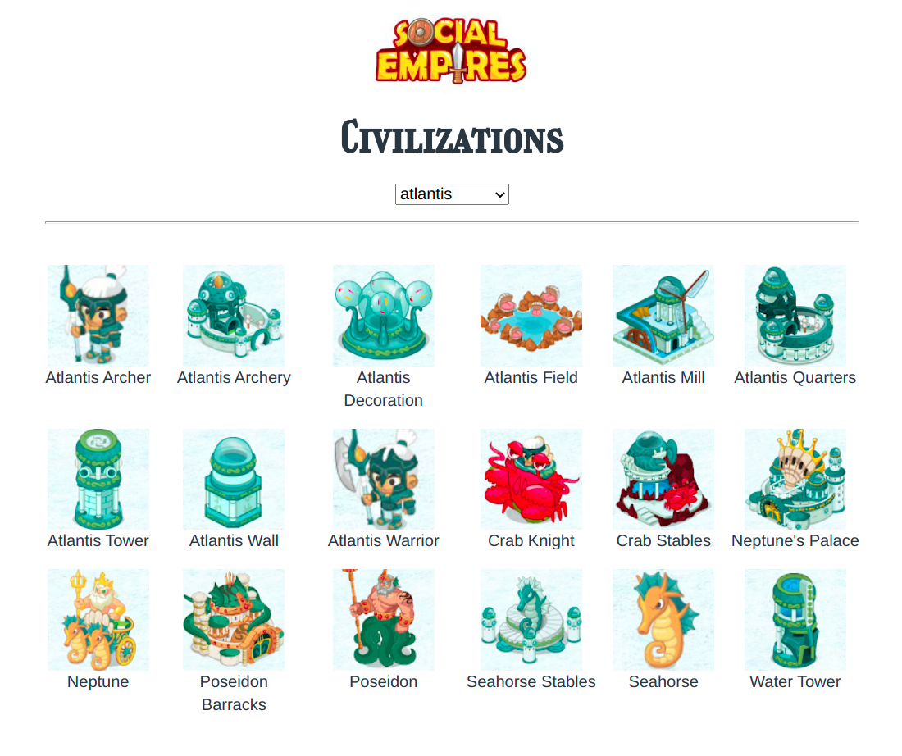

## Social Empires civilization gallery
Browse units, decorations, buildings (and more) of different Social Empires civilizations!

Inspired by [video by Hong Yao](https://www.youtube.com/watch?v=k7tR9cOjO0g)

Made with [React](https://reactjs.org)



**Note**: not all image/civilization names might be accurate

## How it was made

Images were obtained from [Google sheet document by Hong Yao](https://docs.google.com/spreadsheets/d/1UTj8a_ie4BrixZcTBerNbhft4iZB3S0rWo1OKgfjhAo/edit#gid=0)

**Note**: The document has since been updated by the original author. It now contains sheet for every civilization and images/titles are in order. I have made Python script to generate new data from every sheet and updated the image list. Below is described how I grabbed the data when it wasn't as organized.

---

I parsed `src` attributes of images in the document using basic Javascript in browser console and stored them in text file:
```
https://lh6.googleusercontent.com/ju5_IzrOI2kRZBKC1o9fnPRtbUNhL2OygWs53l641VIpwk3_IGXuYsxl7GAY7yM-WLRZX-khm13imunc5jppXvanQ5iVx_XF20-6xUC30IyrFkIICl6uBQsOWH06aJ7Kcqq1vOuq2g=w100-h99
https://lh4.googleusercontent.com/-MdVn-A0O-zxy3op3kjKwI_vocbe_m8MlYF--BkRvT3Le4vOg2CgTdRdMr8PFPVBVlJTeuIGX0z6hE_xxEFKh9_yZmxarDytGQ3Id9UsHl3EIlyR8iyhwQACenACjqpbpDsnkPYsdw=w100-h99
https://lh3.googleusercontent.com/ezIBr9yjuVHBXTqjLuQ9VTuuVlgSYmUwD1rnKf4W2Uy4QxwEPn6aWhK6BAwjljHKWHkob9K0xKuT7e_KcggxlcH2-pQ_8OOgKgjlRXKeHUlocr_IwjnWdAErIH7MsOdljfgCngXoew=w100-h99
https://lh5.googleusercontent.com/AevdwP8KyA4Ve6JyoQYD_isLobq7-95CRTxTlteOfdaGhDYJFVRL3hvOgpIfSKzEhMZcJC1WJmu6U_e7vb_obZyv-rXcCcRKDsbWKZpWuF02IwPXfk_vrlIBuLNIF9VMhdQlXxva9g=w100-h99
https://lh4.googleusercontent.com/JrPp0dxA0b5c1CjHH-28juJDBma3kylfr_4JIfGV1ENLiocdaoXSkHzGPTeRFj4xRInp8aii7nxrhC6GlrmYbMEOVKNXkCubvJxAqkpPbnEiFgHLIooDccbLWZd364gMHeeLkMwsig=w100-h99
...
```
>links.txt

I downloaded all of them (> 1000) to not risk losing access (in case Google document gets deleted, which is probably unlikely).

I also had to parse image titles (and store them in a text file) from the Google document since downloaded images came with names such as `Capture_2020_09_19_17_41_26_749`.

Also made sure titles and links lined up, lots of title fields in the Google document were either empty or missing image.

From there, I renamed downloaded images with the names in `titles.txt` and moved them in separate directories based on:

- civilization name in title
- visual similarity to civilization theme
- remembering that it belongs to certain civilization

## About the game
- By: [Socialpoint](https://www.socialpoint.es/)
- Release date: 2011
- Status: discontinued

Social Empires is still preserved on this site: http://www.4399.com/flash/101868.htm and available to play (you must have Flash Player enabled)
